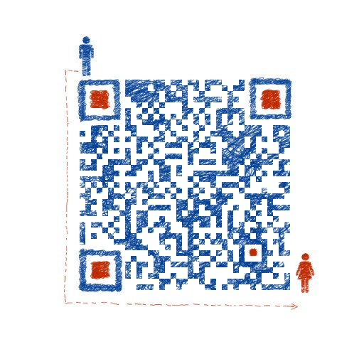

# About Causal AI

当前众多强人工智能尝试中，我们的选择是: Pearl -> Scholkopf -> Bengio。我们专注于构建以小图灵测试为目标的 Causal AI 系统。

Judea Pearl 是 Causal AI 的奠基人，Bernhard Scholkopf 推进了 Causality for Machine Learning，Yoshua Bengio 提出了 System 2 deep learning 作为 Causal AI 的一个范式。沉醉于 life and Intelligence 之美，尤其是人类社会系统的群体智能。众多工具中（包括数学，计算机，物理，复杂系统等等），偏好用信息论视角研究如何教会机器因果思维，希望创造具备 free will 的 AI，使之成为我们的良师益友，一起探索解密生命和智能的终极奥秘。

See more information on [Blog](https://sites.google.com/view/minituring/home), [github](https://sites.google.com/view/minituring/home).

如果您希望踏上教会机器因果思维的强人工智能之路，请加入我们！

</img>

+++++++++++++ Mini Turing Test +++++++++++++++

> How can machines represent causal knowledge in a way that would enable them to access the necessary information swiftly, answer questions correctly, and do it with ease, as a human can? 
